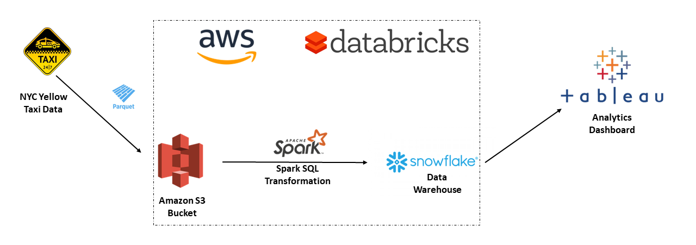
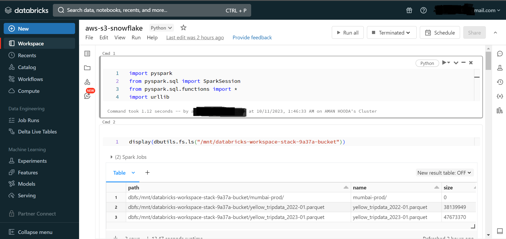
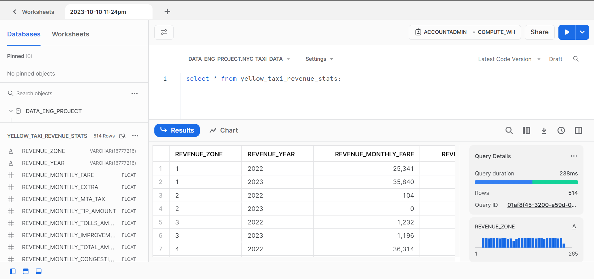

# AWS_Data_Analytics_Pipeline

A Data pipeline made using Amazon-S3,Snowflake and SparkSQL,deployed on AWS using Databricks.

## Description

### Objective
This project simulates converting raw data from the producer, transforming it for an analytics use case and storing it on a data warehouse, from where it can be easily accessed by several teams to make analytical decisions

### Dataset

The dataset is sourced from NYC taxi website https://www.nyc.gov/site/tlc/about/tlc-trip-record-data.page,  
Contains data for January 2022 and January 2023, about 5 million records

### Architecture


### Tools & Technologies

- Cloud - [**AWS**](https://aws.amazon.com/)
- Infrastructure - [**Databricks**](https://www.databricks.com/)
- Transformation - [**SparkSQL**](https://spark.apache.org/)
- Data Lake - [**AWS S3**](https://aws.amazon.com/s3/)
- Data Warehouse - [**Snowflake**](https://www.snowflake.com/en/)
- Data Visualization - [**Tableau**](https://www.tableau.com/)
- Language - [**Python**](https://www.python.org)

### Final Result

<div class='tableauPlaceholder' id='viz1696973965570' style='position: relative'><noscript><a href='#'></a></noscript><object class='tableauViz'  style='display:none;'><param name='host_url' value='https%3A%2F%2Fpublic.tableau.com%2F' /> <param name='embed_code_version' value='3' /> <param name='site_root' value='' /><param name='name' value='NYC_yellow_taxi_revenue&#47;Dashboard1' /><param name='tabs' value='no' /><param name='toolbar' value='yes' /><param name='static_image' value='https:&#47;&#47;public.tableau.com&#47;static&#47;images&#47;NY&#47;NYC_yellow_taxi_revenue&#47;Dashboard1&#47;1.png' /> <param name='animate_transition' value='yes' /><param name='display_static_image' value='yes' /><param name='display_spinner' value='yes' /><param name='display_overlay' value='yes' /><param name='display_count' value='yes' /><param name='language' value='en-US' /><param name='filter' value='publish=yes' /></object></div> 

This Dashboard compares revenue difference between Jan 2022,2023.  
Also provides insights on revenue collections based on Location ID. 

### Project Walkthrough

The cloud infrastructure for this project consists of :
* A Databricks stack created on AWS  
* A Snowflake data warehouse

1.Create a quickstart Databricks stack on AWS.   
2.The data files in parquet format have been stored in the S3-bucket.  
3.Initiate creation of a new Single node Compute cluster from Databricks.
4.Create a new database and schema on snowflake to store the data.  
4.This jupyter notebook contains the transformations steps and explanations:   

```bash
Transform_Upload.ipynb
```  
  

this sparkSQL job Transforms and uploads the data to snowflake data warehouse.  
  


This Snowflake table can be connected to Tableau to create a dashboard as seen in https://github.com/amanhooda98/AWS_Data_Analytics_Pipeline#final-result.


    

